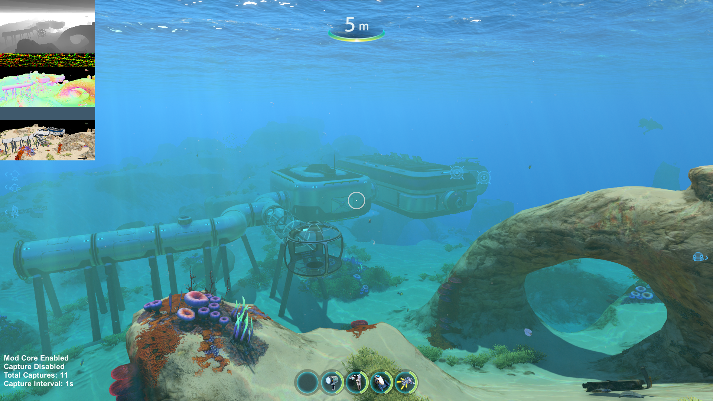
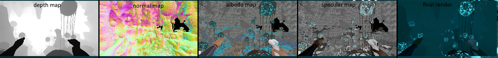

## Objective
capture the g-buffers of Subnautica (and Subnautica Below Zero) and save them in JPG format to create a rich dataset.  
  
the captured gbuffers are:  
- Final Render (WORKING)  
- World Normal Map (WORKING)  
- Depth Map (WORKING)  
- Albedo Map (WORKING)  
- Emission Map (NOT WORKING)  
- ShaderID/Segmentation per Material (NOT WORKING)  
  
  
  
  
## How to use  
Install by extrating .zip inside "PathToSubnauticaFolder/BepInEx/plugins".  
You can configure the mod inside the game by pressing F1. (ConfigurationManager required)  
Press F11 to toggle mod core.  
Then, press F10 to toggle recording. 
The captures are taken every one second by default.  
The captures will be at "PathToSubnauticaFolder/BepInEx/plugins/GBufferCapture/captures".  
Press NUMBER 9 to toggle fog without affecting captures.  
  
RECOMMENDATIONS:  
use dev commands such as "daynightspeed 100" to increase light diversity in you dataset.  
SHIFT + ENTER opens command entry.  
Remove game GUI from captures by pressing F6.  
  
## Requirements
- https://github.com/BepInEx/BepInEx  
- https://github.com/BepInEx/BepInEx.ConfigurationManager (configure in-game mod variables)  

## Utils
For those who want to improve this project.  
use Unity 2019.4.36f1: https://unity.com/releases/editor/archive  
Compile the shaders inside Unity Project, just by executing: Build -> Build Shader AssetBundle.  

- https://github.com/sinai-dev/UnityExplorer (very useful to inspect gameobjects ingame)  
- https://github.com/AssetRipper/AssetRipper (very useful to decompile subnautica and read every script/shader of the game, remember to use "decompile" shader option)  
