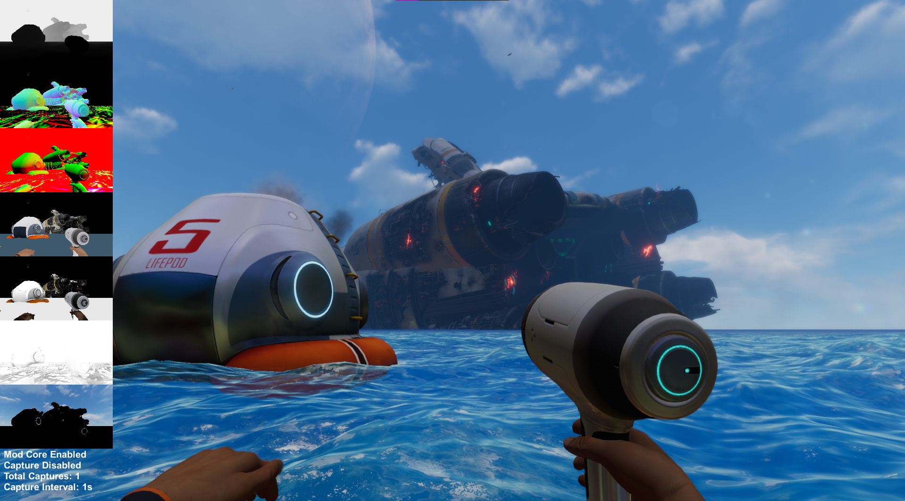
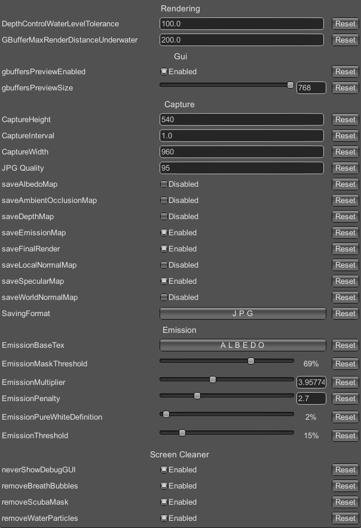

## Objective
capture the g-buffers of Subnautica (and Subnautica Below Zero) and save them in JPG/PNG format to create a rich dataset.  
  
the captured gbuffers are:  
- Final Render (WORKING)  
- World Normal Map (WORKING)  
- Local Normal Map (WORKING)  
- Depth Map (WORKING)  
- Albedo Map (WORKING)  
- Specular Map (WORKING)  
- Ambient Occlusion (WORKING)  
- Before Lightning (WORKING, USED AS EMISSION MAP APPROXIMATION)  
  

  
## How to use  
Install by extrating .zip inside "PathToSubnauticaFolder/BepInEx/plugins".  
You can configure the mod inside the game by pressing F1. (ConfigurationManager required)  
Press F11 to toggle mod core.  
Then, press F10 to toggle recording. 
The captures are taken every one second by default.  
The captures will be at "PathToSubnauticaFolder/BepInEx/plugins/GBufferCapture/captures".  
F9 takes a single capture.  
  
RECOMMENDATIONS:  
- use dev commands such as "daynightspeed 100" to increase light diversity in you dataset. (SHIFT + ENTER opens command entry)  
- In graphics disable "motion blur" and "lens dirt"
  
## Requirements
- https://www.nexusmods.com/subnautica/mods/1108?tab=files&file_id=8140
- https://github.com/BepInEx/BepInEx.ConfigurationManager (configure in-game mod variables)  

### Support the project ☕

Please, dont hesitate to colaborate with the project. Give your ⭐
  
| Rede | Ícone | Endereço |
| :--- | :---: | :--- |
| **Bitcoin** |  | `bc1qg6ava2w08d5k2588edylj08ux4yuhn74yygsnr` |
| **Ethereum** |  | `0xcD36cf511646bD39Cb23f425786a4f3699CcFD2a` |
| **Solana** |  | `FKotLMzTKNbdZcKXkXsPuP1hcXGiXfScjB7qvSCQAev2` |
| **BNB Chain** |  | `0xcD36cf511646bD39Cb23f425786a4f3699CcFD2a` |
| **TRON** |  | `TWhZLJ61uY1bo8zicwhnfS5NKuuD6BJ8D8` |

## Utils
For those who want to improve this project.  
use Unity 2019.4.36f1: https://unity.com/releases/editor/archive  

- https://github.com/yukieiji/UnityExplorer (very useful to inspect gameobjects ingame)  
- https://github.com/AssetRipper/AssetRipper (very useful to decompile subnautica and read every script/shader of the game, remember to use "decompile" shader option)  

## To do

- ShaderID/Segmentation per Material  